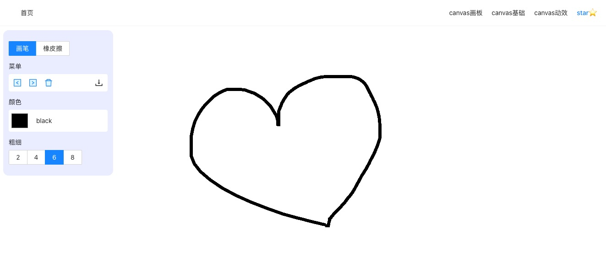

# Canvas drawing board



## 关于

* 带你了解Canvas的基本方法，看看它能延展出哪些有趣的效果，最后我们完成一个Canvas画板，并将它迭代到一定的高度吧！
* Star⭐️ 不走丢哦~

<p align=center>Go -> <a href="https://webbj97.github.io/yuguang-canvas/" target="_blank">Canvas drawing board</a> </p>
  
## Installation

```js
clone 仓库地址

cd 代码仓库

yarn

yarn dev
```

## 技术栈

* 语言：Vue3、TypeScript、Less
* 组件：Element-UI
* 编辑器：VsCode

## 进度

* [ ] Canvas画板
  * [ ] 基本画笔
    * [x] 画笔
    * [x] 画笔颜色
    * [x] 画笔粗细
    * [ ] 画笔粗细变化
    * [x] 简易橡皮擦
    * [ ] 橡皮擦优化
  * [ ] 画布
    * [x] 单画布 - 撤回
    * [x] 单画布 - 前进
    * [x] 单画布 - 导出图片
    * [x] 单画布 - 重置
    * [ ] 单画布 - 缩放
    * [ ] 多画布叠加
    * [ ] 多画布拖拽
* [ ] 基本API
  * [x] 矩形
  * [x] 线段
  * [ ] ...
* [ ] 粒子动效
  * [x] 粒子碰撞
  * [x] 粒子关联
  * [ ] ....
* [ ] 移动端适配  

